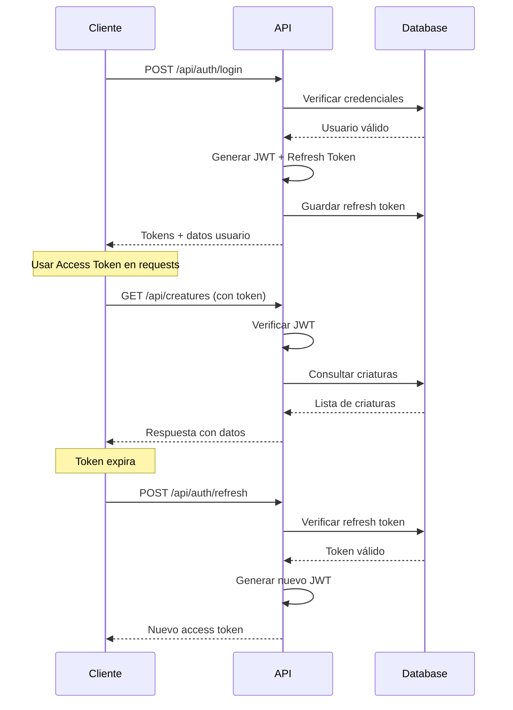
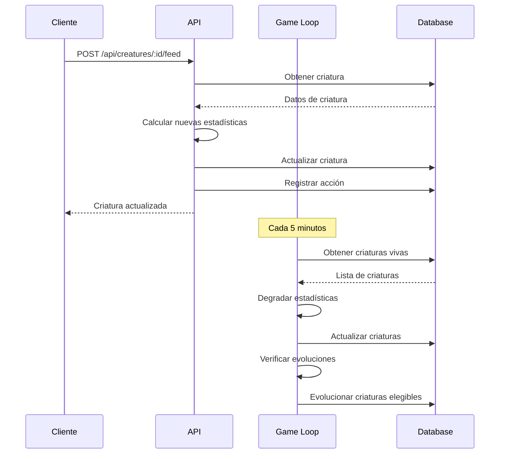
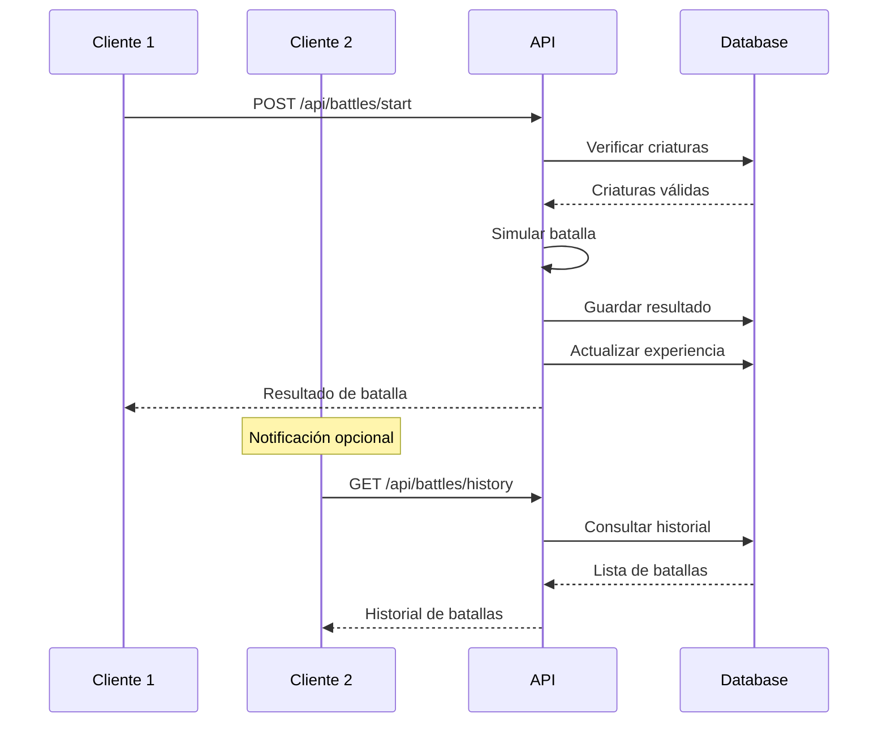

# 🏗️ Arquitectura del Sistema - Tamagotchi Pro

Este documento describe la arquitectura técnica completa del sistema Tamagotchi Pro, incluyendo componentes, patrones de diseño, flujos de datos y decisiones arquitectónicas.

## 📊 Visión General de la Arquitectura

Tamagotchi Pro sigue una arquitectura de **3 capas** con separación clara de responsabilidades:

```
┌─────────────────────────────────────────────────────────────┐
│                    CAPA DE PRESENTACIÓN                     │
│  ┌─────────────────┐  ┌─────────────────┐  ┌─────────────┐ │
│  │   Web Client    │  │   Mobile PWA    │  │  Admin UI   │ │
│  │  (Vanilla JS)   │  │ (Service Worker)│  │ (Dashboard) │ │
│  └─────────────────┘  └─────────────────┘  └─────────────┘ │
└─────────────────────────────────────────────────────────────┘
                              │
                              ▼
┌─────────────────────────────────────────────────────────────┐
│                     CAPA DE APLICACIÓN                     │
│  ┌─────────────────┐  ┌─────────────────┐  ┌─────────────┐ │
│  │   API Gateway   │  │  Authentication │  │   Game Loop │ │
│  │   (Express.js)  │  │      (JWT)      │  │ (Background)│ │
│  └─────────────────┘  └─────────────────┘  └─────────────┘ │
│  ┌─────────────────┐  ┌─────────────────┐  ┌─────────────┐ │
│  │   Controllers   │  │   Middleware    │  │   Services  │ │
│  │   (Routes)      │  │   (Security)    │  │ (Business)  │ │
│  └─────────────────┘  └─────────────────┘  └─────────────┘ │
└─────────────────────────────────────────────────────────────┘
                              │
                              ▼
┌─────────────────────────────────────────────────────────────┐
│                      CAPA DE DATOS                         │
│  ┌─────────────────┐  ┌─────────────────┐  ┌─────────────┐ │
│  │   PostgreSQL    │  │      Redis      │  │ File System │ │
│  │   (Principal)   │  │     (Cache)     │  │  (Assets)   │ │
│  └─────────────────┘  └─────────────────┘  └─────────────┘ │
└─────────────────────────────────────────────────────────────┘
```

## 🎯 Principios Arquitectónicos

### 1. **Separación de Responsabilidades**
- **Frontend**: Solo presentación y experiencia de usuario
- **Backend**: Lógica de negocio, validación y persistencia
- **Base de Datos**: Almacenamiento y consultas optimizadas

### 2. **Escalabilidad Horizontal**
- API stateless que permite múltiples instancias
- Base de datos con capacidad de sharding
- CDN para assets estáticos

### 3. **Seguridad por Capas**
- Autenticación JWT con refresh tokens
- Rate limiting por endpoint
- Sanitización de entrada en múltiples niveles
- Headers de seguridad HTTP

### 4. **Tolerancia a Fallos**
- Health checks automáticos
- Graceful degradation
- Circuit breakers para servicios externos
- Backup y recovery automatizado

## 🔧 Componentes del Sistema

### Frontend (Cliente Web)

#### Tecnologías
- **Vanilla JavaScript ES2022**: Máximo rendimiento sin frameworks
- **Canvas 2D**: Animaciones fluidas de criaturas
- **CSS Grid/Flexbox**: Layouts responsivos
- **Service Workers**: Funcionalidad offline
- **Vite**: Build tool moderno

#### Estructura de Archivos
```
client/
├── src/
│   ├── main.js              # Punto de entrada principal
│   ├── components/          # Componentes reutilizables
│   │   ├── creature.js      # Lógica de criaturas
│   │   ├── ui.js           # Elementos de interfaz
│   │   └── canvas.js       # Renderizado 2D
│   ├── services/           # Servicios de API
│   │   ├── api.js          # Cliente HTTP
│   │   ├── auth.js         # Autenticación
│   │   └── storage.js      # LocalStorage
│   ├── utils/              # Utilidades
│   │   ├── helpers.js      # Funciones auxiliares
│   │   └── constants.js    # Constantes
│   └── styles/             # Estilos CSS
│       ├── main.css        # Estilos principales
│       ├── components.css  # Estilos de componentes
│       └── animations.css  # Animaciones
├── public/                 # Assets estáticos
│   ├── icons/             # Iconos PWA
│   ├── manifest.json      # Manifiesto PWA
│   └── sw.js             # Service Worker
└── assets/               # Assets del juego
    ├── creatures/        # Sprites de criaturas
    ├── ui/              # Iconos de UI
    └── backgrounds/     # Fondos
```

#### Patrones de Diseño Frontend
- **Module Pattern**: Encapsulación de funcionalidad
- **Observer Pattern**: Eventos de UI y estado
- **State Management**: Estado centralizado simple
- **Component Pattern**: Componentes reutilizables

### Backend (API Server)

#### Tecnologías
- **Node.js + TypeScript**: Type safety y rendimiento
- **Express.js**: Framework web minimalista
- **PostgreSQL**: Base de datos relacional robusta
- **JWT**: Autenticación stateless
- **Helmet**: Headers de seguridad

#### Estructura de Archivos
```
server/
├── src/
│   ├── app.ts                    # Configuración de Express
│   ├── server.ts                 # Punto de entrada
│   ├── config/                   # Configuraciones
│   │   └── database.ts           # Pool de PostgreSQL
│   ├── middleware/               # Middleware personalizado
│   │   ├── auth.ts              # Autenticación JWT
│   │   ├── validation.ts        # Validación de datos
│   │   └── security.ts          # Seguridad adicional
│   ├── routes/                   # Controladores de rutas
│   │   ├── auth.ts              # Autenticación
│   │   ├── creatures.ts         # Gestión de criaturas
│   │   ├── battles.ts           # Sistema de batallas
│   │   ├── achievements.ts      # Logros
│   │   ├── evolution.ts         # Evolución
│   │   ├── leaderboard.ts       # Rankings
│   │   └── admin.ts             # Administración
│   └── utils/                    # Utilidades
│       ├── gameLoop.ts          # Loop principal del juego
│       └── metrics.ts           # Sistema de métricas
├── migrations/                   # Migraciones de BD
│   └── 001_initial_schema.sql   # Esquema inicial
└── shared/                       # Tipos compartidos
    └── types.ts                  # Interfaces TypeScript
```

#### Patrones de Diseño Backend
- **MVC Pattern**: Separación modelo-vista-controlador
- **Repository Pattern**: Abstracción de acceso a datos
- **Middleware Pattern**: Pipeline de procesamiento
- **Singleton Pattern**: Instancias únicas (DB pool, metrics)

### Base de Datos (PostgreSQL)

#### Esquema de Datos

```sql
-- Usuarios del sistema
CREATE TABLE users (
    id UUID PRIMARY KEY DEFAULT gen_random_uuid(),
    username VARCHAR(50) UNIQUE NOT NULL,
    email VARCHAR(255) UNIQUE NOT NULL,
    password_hash VARCHAR(255) NOT NULL,
    created_at TIMESTAMP DEFAULT NOW(),
    updated_at TIMESTAMP DEFAULT NOW()
);

-- Criaturas virtuales
CREATE TABLE creatures (
    id UUID PRIMARY KEY DEFAULT gen_random_uuid(),
    user_id UUID REFERENCES users(id) ON DELETE CASCADE,
    name VARCHAR(50) NOT NULL,
    species VARCHAR(20) NOT NULL,
    stage VARCHAR(20) DEFAULT 'egg',
    personality VARCHAR(20) NOT NULL,
    mood VARCHAR(20) DEFAULT 'neutral',
    
    -- Estadísticas básicas
    hunger INTEGER DEFAULT 80 CHECK (hunger >= 0 AND hunger <= 100),
    happiness INTEGER DEFAULT 70 CHECK (happiness >= 0 AND happiness <= 100),
    health INTEGER DEFAULT 100 CHECK (health >= 0 AND health <= 100),
    energy INTEGER DEFAULT 90 CHECK (energy >= 0 AND energy <= 100),
    cleanliness INTEGER DEFAULT 100 CHECK (cleanliness >= 0 AND cleanliness <= 100),
    
    -- Estadísticas avanzadas
    intelligence INTEGER DEFAULT 10 CHECK (intelligence >= 0 AND intelligence <= 100),
    strength INTEGER DEFAULT 10 CHECK (strength >= 0 AND strength <= 100),
    agility INTEGER DEFAULT 10 CHECK (agility >= 0 AND agility <= 100),
    
    -- Progresión
    level INTEGER DEFAULT 1,
    experience INTEGER DEFAULT 0,
    evolution_points INTEGER DEFAULT 0,
    age INTEGER DEFAULT 0, -- En horas
    
    -- Timestamps de acciones
    birth_date TIMESTAMP DEFAULT NOW(),
    last_fed TIMESTAMP DEFAULT NOW(),
    last_played TIMESTAMP DEFAULT NOW(),
    last_cleaned TIMESTAMP DEFAULT NOW(),
    
    -- Estado
    is_alive BOOLEAN DEFAULT true,
    traits JSONB DEFAULT '[]',
    
    created_at TIMESTAMP DEFAULT NOW(),
    updated_at TIMESTAMP DEFAULT NOW()
);

-- Acciones realizadas en criaturas
CREATE TABLE creature_actions (
    id UUID PRIMARY KEY DEFAULT gen_random_uuid(),
    creature_id UUID REFERENCES creatures(id) ON DELETE CASCADE,
    action_type VARCHAR(20) NOT NULL, -- feed, play, clean, sleep
    details JSONB DEFAULT '{}',
    created_at TIMESTAMP DEFAULT NOW()
);

-- Sistema de logros
CREATE TABLE achievements (
    id UUID PRIMARY KEY DEFAULT gen_random_uuid(),
    name VARCHAR(100) NOT NULL,
    description TEXT NOT NULL,
    icon VARCHAR(50) NOT NULL,
    rarity VARCHAR(20) NOT NULL, -- common, uncommon, rare, epic, legendary
    conditions JSONB NOT NULL,
    created_at TIMESTAMP DEFAULT NOW()
);

-- Logros desbloqueados por usuarios
CREATE TABLE user_achievements (
    id UUID PRIMARY KEY DEFAULT gen_random_uuid(),
    user_id UUID REFERENCES users(id) ON DELETE CASCADE,
    achievement_id UUID REFERENCES achievements(id) ON DELETE CASCADE,
    unlocked_at TIMESTAMP DEFAULT NOW(),
    UNIQUE(user_id, achievement_id)
);

-- Sistema de batallas
CREATE TABLE battles (
    id UUID PRIMARY KEY DEFAULT gen_random_uuid(),
    winner_id UUID REFERENCES users(id),
    loser_id UUID REFERENCES users(id),
    winner_creature_id UUID REFERENCES creatures(id),
    loser_creature_id UUID REFERENCES creatures(id),
    experience_gained INTEGER NOT NULL,
    battle_log JSONB NOT NULL,
    duration INTEGER NOT NULL, -- En segundos
    created_at TIMESTAMP DEFAULT NOW()
);

-- Tokens de refresh para autenticación
CREATE TABLE refresh_tokens (
    id UUID PRIMARY KEY DEFAULT gen_random_uuid(),
    user_id UUID REFERENCES users(id) ON DELETE CASCADE,
    token_hash VARCHAR(255) NOT NULL,
    expires_at TIMESTAMP NOT NULL,
    created_at TIMESTAMP DEFAULT NOW()
);
```

#### Índices para Rendimiento
```sql
-- Índices para consultas frecuentes
CREATE INDEX idx_creatures_user_id ON creatures(user_id);
CREATE INDEX idx_creatures_alive ON creatures(is_alive) WHERE is_alive = true;
CREATE INDEX idx_creatures_species ON creatures(species);
CREATE INDEX idx_creature_actions_creature_id ON creature_actions(creature_id);
CREATE INDEX idx_creature_actions_type_date ON creature_actions(action_type, created_at);
CREATE INDEX idx_battles_winner ON battles(winner_id);
CREATE INDEX idx_battles_loser ON battles(loser_id);
CREATE INDEX idx_battles_date ON battles(created_at);
CREATE INDEX idx_user_achievements_user ON user_achievements(user_id);
CREATE INDEX idx_refresh_tokens_user ON refresh_tokens(user_id);
CREATE INDEX idx_refresh_tokens_expires ON refresh_tokens(expires_at);
```

## 🔄 Flujos de Datos Principales

### 1. Flujo de Autenticación



### 2. Flujo de Cuidado de Criatura



### 3. Flujo de Batalla



## 🎮 Sistema de Game Loop

El Game Loop es el corazón del sistema que mantiene el mundo virtual funcionando 24/7:

### Componentes del Game Loop

```typescript
class GameLoop {
  private intervalId: NodeJS.Timeout | null = null;
  private readonly INTERVAL = 5 * 60 * 1000; // 5 minutos

  async updateCreatures() {
    // 1. Degradar estadísticas por tiempo transcurrido
    // 2. Verificar condiciones de muerte
    // 3. Actualizar edad de criaturas
  }

  async checkEvolutions() {
    // 1. Verificar requisitos de evolución
    // 2. Evolucionar criaturas elegibles
    // 3. Aplicar bonificaciones
  }

  async processAchievements() {
    // 1. Verificar condiciones de logros
    // 2. Desbloquear logros nuevos
    // 3. Notificar a usuarios
  }
}
```

### Algoritmo de Degradación

```typescript
const STAT_DEGRADATION = {
  hunger: 2,      // -2 por hora
  happiness: 1,   // -1 por hora
  energy: 1,      // -1 por hora
  cleanliness: 1  // -1 por hora
};

function degradeStats(creature: Creature, hoursPassed: number) {
  return {
    hunger: Math.max(0, creature.hunger - (STAT_DEGRADATION.hunger * hoursPassed)),
    happiness: Math.max(0, creature.happiness - (STAT_DEGRADATION.happiness * hoursPassed)),
    energy: Math.max(0, creature.energy - (STAT_DEGRADATION.energy * hoursPassed)),
    cleanliness: Math.max(0, creature.cleanliness - (STAT_DEGRADATION.cleanliness * hoursPassed))
  };
}
```

## 🔒 Arquitectura de Seguridad

### Capas de Seguridad

1. **Capa de Red**
   - Firewall (UFW/iptables)
   - Rate limiting por IP
   - DDoS protection

2. **Capa de Aplicación**
   - JWT con expiración corta
   - Refresh tokens rotativos
   - CORS configurado
   - Headers de seguridad

3. **Capa de Datos**
   - Sanitización de entrada
   - Prepared statements
   - Validación de tipos
   - Encriptación de passwords

### Flujo de Autenticación JWT

```typescript
interface JWTPayload {
  userId: string;
  username: string;
  iat: number;
  exp: number;
}

interface RefreshTokenPayload {
  userId: string;
  tokenId: string;
  iat: number;
  exp: number;
}

// Access Token: 1 hora
// Refresh Token: 7 días
```

### Rate Limiting Strategy

```typescript
const rateLimits = {
  auth: { windowMs: 15 * 60 * 1000, max: 5 },      // 5 intentos/15min
  api: { windowMs: 15 * 60 * 1000, max: 100 },     // 100 requests/15min
  battles: { windowMs: 60 * 1000, max: 10 }        // 10 batallas/min
};
```

## 📊 Sistema de Métricas y Monitoreo

### Métricas Recolectadas

1. **Métricas de Aplicación**
   - Usuarios activos por hora/día
   - Criaturas creadas/muertas
   - Acciones por tipo (feed, play, clean)
   - Batallas por hora
   - Logros desbloqueados

2. **Métricas de Sistema**
   - Tiempo de respuesta de API
   - Uso de memoria/CPU
   - Conexiones de base de datos
   - Errores por endpoint

3. **Métricas de Negocio**
   - Retención de usuarios
   - Tiempo de sesión promedio
   - Especies más populares
   - Nivel promedio de criaturas

### Arquitectura de Monitoreo

```
┌─────────────────┐    ┌─────────────────┐    ┌─────────────────┐
│   Application   │───▶│   Metrics       │───▶│   Dashboard     │
│   (Collectors)  │    │   (Aggregator)  │    │   (Grafana)     │
└─────────────────┘    └─────────────────┘    └─────────────────┘
         │                       │                       │
         ▼                       ▼                       ▼
┌─────────────────┐    ┌─────────────────┐    ┌─────────────────┐
│      Logs       │    │   Time Series   │    │     Alerts      │
│   (Winston)     │    │   (Prometheus)  │    │   (Slack/Email) │
└─────────────────┘    └─────────────────┘    └─────────────────┘
```

## 🚀 Estrategias de Escalabilidad

### Escalabilidad Horizontal

1. **API Stateless**
   - Sin estado en memoria
   - Load balancer (Nginx/HAProxy)
   - Múltiples instancias de Node.js

2. **Base de Datos**
   - Read replicas para consultas
   - Sharding por user_id
   - Connection pooling

3. **Cache Layer**
   - Redis para sesiones
   - Cache de consultas frecuentes
   - CDN para assets estáticos

### Optimizaciones de Rendimiento

1. **Frontend**
   - Lazy loading de componentes
   - Service Worker caching
   - Compresión de assets
   - Minificación de código

2. **Backend**
   - Índices de base de datos optimizados
   - Consultas SQL eficientes
   - Compresión gzip
   - Keep-alive connections

3. **Base de Datos**
   - Particionado por fecha
   - Archivado de datos antiguos
   - Vacuum automático
   - Análisis de consultas lentas

## 🔄 Patrones de Integración

### API Design Patterns

1. **RESTful API**
   - Recursos claramente definidos
   - Métodos HTTP semánticos
   - Códigos de estado apropiados
   - Versionado de API

2. **Response Patterns**
   ```typescript
   interface ApiResponse<T = any> {
     success: boolean;
     data?: T;
     error?: string;
     message?: string;
   }
   ```

3. **Error Handling**
   - Errores estructurados
   - Logging centralizado
   - Graceful degradation
   - Circuit breakers

### Event-Driven Architecture

```typescript
// Eventos del sistema
enum GameEvent {
  CREATURE_CREATED = 'creature.created',
  CREATURE_FED = 'creature.fed',
  CREATURE_EVOLVED = 'creature.evolved',
  BATTLE_COMPLETED = 'battle.completed',
  ACHIEVEMENT_UNLOCKED = 'achievement.unlocked'
}

// Event emitter para desacoplamiento
class GameEventEmitter extends EventEmitter {
  emitCreatureEvolved(creature: Creature) {
    this.emit(GameEvent.CREATURE_EVOLVED, { creature });
  }
}
```

## 📱 Arquitectura PWA

### Service Worker Strategy

```typescript
// Estrategias de cache
const cacheStrategies = {
  static: 'cache-first',      // Assets estáticos
  api: 'network-first',       // Datos dinámicos
  images: 'cache-first',      // Imágenes de criaturas
  offline: 'cache-only'       // Fallback offline
};
```

### Offline Capabilities

1. **Cache de Assets**
   - Sprites de criaturas
   - Iconos de UI
   - Estilos CSS
   - JavaScript core

2. **Datos Offline**
   - Estado de criaturas
   - Acciones pendientes
   - Configuración de usuario

3. **Sync en Background**
   - Sincronización automática
   - Queue de acciones
   - Resolución de conflictos

## 🔧 Decisiones Arquitectónicas

### ¿Por qué Vanilla JavaScript?

**Ventajas:**
- Máximo rendimiento sin overhead de frameworks
- Control total sobre el DOM y eventos
- Menor tamaño de bundle
- Compatibilidad universal

**Desventajas:**
- Más código boilerplate
- Sin ecosistema de componentes
- Gestión manual del estado

### ¿Por qué PostgreSQL?

**Ventajas:**
- ACID compliance para consistencia
- Soporte JSON para datos flexibles
- Extensibilidad y funciones avanzadas
- Rendimiento excelente

**Desventajas:**
- Mayor complejidad que NoSQL
- Configuración más elaborada
- Escalabilidad horizontal limitada

### ¿Por qué TypeScript en Backend?

**Ventajas:**
- Type safety en tiempo de compilación
- Mejor experiencia de desarrollo
- Refactoring seguro
- Documentación implícita

**Desventajas:**
- Tiempo de compilación adicional
- Curva de aprendizaje
- Configuración más compleja

## 📈 Métricas de Arquitectura

### Objetivos de Rendimiento

- **Tiempo de respuesta API**: < 200ms (p95)
- **Tiempo de carga inicial**: < 3 segundos
- **Disponibilidad**: 99.9% uptime
- **Throughput**: 1000 requests/segundo
- **Escalabilidad**: 10,000 usuarios concurrentes

### Métricas de Calidad

- **Cobertura de tests**: > 80%
- **Complejidad ciclomática**: < 10
- **Deuda técnica**: < 5% del tiempo de desarrollo
- **Tiempo de despliegue**: < 5 minutos
- **MTTR (Mean Time to Recovery)**: < 30 minutos

Esta arquitectura proporciona una base sólida, escalable y mantenible para el crecimiento futuro de Tamagotchi Pro, balanceando rendimiento, seguridad y experiencia de usuario.

